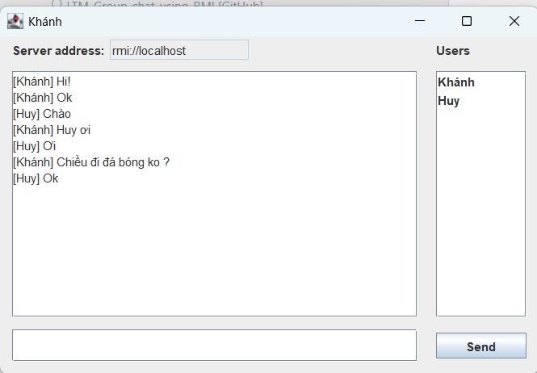

<h2 align="center">
    <a href="https://dainam.edu.vn/vi/khoa-cong-nghe-thong-tin">
    🎓 Faculty of Information Technology (DaiNam University)
    </a>
</h2>
<h2 align="center">
  📌 CHAT NHÓM BẰNG RMI 

</h2>
<div align="center">
    <p align="center">
        
        
        
    </p>

[](https://www.facebook.com/DNUAIoTLab)
[](https://dainam.edu.vn/vi/khoa-cong-nghe-thong-tin)
[](https://dainam.edu.vn)

</div>

## 📖 1. Giới thiệu hệ thống 
Ứng dụng Chat nhóm bằng RMI được xây dựng nhằm hỗ trợ người dùng trao đổi thông tin theo thời gian thực qua mô hình Client – Server. Người dùng có thể tạo kết nối tới server và tham gia phòng chat để nhắn tin, gửi thông báo, và theo dõi các thành viên khác đang online.

🎯 Các chức năng chính:<br>
> ● Gửi và nhận tin nhắn theo thời gian thực.<br>
> ● Hiển thị danh sách người dùng.<br>
> ● Hỗ trợ chat nhóm (mọi tin nhắn đều được broadcast đến tất cả client).<br>

        

## 🔧 2. Công nghệ sử dụng: [](https://www.java.com/)
- **Java RMI (Remote Method Invocation)** – giao tiếp Client - Server.  
- **Java Swing** – xây dựng giao diện client.  
- **Eclipse IDE / NetBeans IDE** – phát triển và chạy chương trình.  

---
## 🖼️ 3.  Hình ảnh các chức năng chính

### 🔹 Giao diện client khi tham gia chat


### 🔹 Chat nhóm và danh sách người dùng online


## 🚀 4.  Các bước cài đặt

### Bước 1: Chuẩn bị môi trường
- Cài đặt **Java JDK 8+**.  
- Cài đặt **Eclipse IDE** hoặc **NetBeans IDE**.  
- Clone project từ GitHub về máy:  
  ```bash
  git clone https://github.com/ten-repo-cua-ban/LTM-Group-chat-using-RMI.git
### Bước 2: Khởi động Server
- Mở project trong Eclipse/NetBeans.

- Chạy file ServerDriver.java để khởi động server.

- Nếu chạy thành công sẽ hiển thị thông báo server đã sẵn sàng lắng nghe client.

### Bước 3: Khởi động Client
- Chạy file ClientDriver.java (có thể mở nhiều cửa sổ client).

- Nhập tên người dùng khi chương trình yêu cầu.

- Kết nối tới server theo địa chỉ: "rmi://localhost/RMIChatServer"
### Bước 4: Bắt đầu chat nhóm 🎉
- Nhập tin nhắn vào ô chat và nhấn Enter hoặc Send để gửi.

- Tin nhắn sẽ được broadcast đến tất cả các client đang tham gia.

- Danh sách người dùng sẽ tự động cập nhật khi có người tham gia hoặc thoát.

✍️ Author: © 2025 **NgocKhanh**, Faculty of Information Technology – DaiNam University. All rights reserved.


---